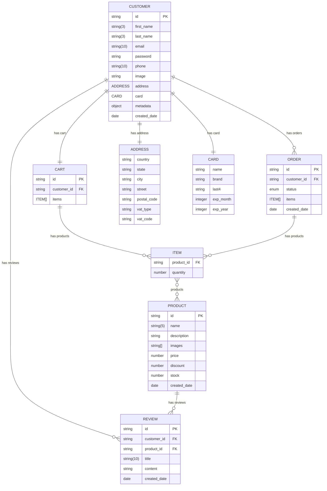

# ShopCart

ShopCart is an app used for buying a wide range of products. All selected products can be paid for online using the card payment method. The customers will receive after payment a invoice with all products purchased. Customers can be individuals or companies.

## Technologies

Below is a list of all the technologies used to develop the app. They are structured by categories.

**Frontend** 
   - HTML
   - CSS
   - JavaScript

**Backend**
   - NodeJS

**Databases**
   - MongoDB

**Cloud**
   - [Stripe](https://stripe.com/docs/api)

## Run & Build commands

As the application is developed using the NodeJS to launch it in development mode or for deployment we should run some commands that allow us to perform these processes.

Before executing any command, we must make sure that the dependencies (**node_modules**) are installed, otherwise we must install them using this command:
```
npm install
```

To run the application use this command:
```
npm run devStart
```

To build the application for deployment use this command:
```
node index.js
```

## Management of Folder & Files

- [Controllers](https://github.com/EddyEduard/ShopCart/tree/main/controllers)
- [Models](https://github.com/EddyEduard/ShopCart/tree/main/models)
- [Views](https://github.com/EddyEduard/ShopCart/tree/main/views)
- [Middlewares](https://github.com/EddyEduard/ShopCart/tree/main/middlewares)
- [Routes](https://github.com/EddyEduard/ShopCart/tree/main/routes)
- [Helpers](https://github.com/EddyEduard/ShopCart/tree/main/helpers)
- [Public](https://github.com/EddyEduard/ShopCart/tree/main/public)

## Database

The database used for data storage is **MongoDB**.

### Entity Relationship Diagram



## License
Distributed under the MIT License. See [MIT](https://github.com/EddyEduard/ShopCart/blob/master/LICENSE) for more information.

## Contact
Eduard-Nicolae - [eduard_nicolae@yahoo.com](mailTo:eduard_nicolae@yahoo.com)
\
Project link - [https://github.com/EddyEduard/ShopCart](https://github.com/EddyEduard/ShopCart.git)
